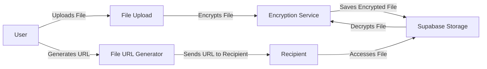
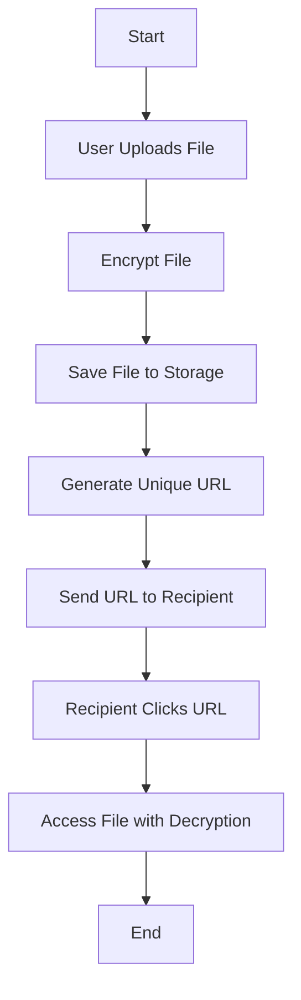
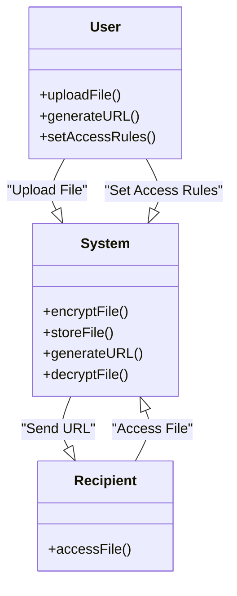

## 1. Introduction

In the contemporary digital landscape, the seamless and secure exchange of information is paramount. Individuals and organizations alike require efficient methods to share files without compromising data integrity or confidentiality. Traditional file-sharing methods often fall short in providing the necessary security measures, leaving sensitive information vulnerable to unauthorized access and cyber threats.

Recognizing these challenges, our project introduces **VortexShare**, a Secure File Sharing Application designed to facilitate the safe and efficient transfer of files. This application ensures that users can upload and share files with confidence, knowing that robust security protocols protect their data. By integrating automatic encryption during the upload process, the application safeguards information from potential breaches.

The application streamlines the sharing process by generating unique URLs for each uploaded file. This feature allows recipients to access the shared content directly, eliminating the need for additional authentication steps while maintaining security. The combination of user-friendly design and stringent security measures ensures that file sharing is both accessible and protected.

To build this application, we have selected a modern technology stack that includes Next.js for the frontend, FastAPI for the backend, and Supabase for storage and database management. This combination offers a responsive user interface, efficient server-side processing, and secure, scalable data storage solutions.

## 2. Problem Statement

Existing file-sharing solutions often encounter several significant challenges:

- Limited Customization: Users frequently lack control over who can access their files and the duration of accessibility
- Security Vulnerabilities: Not all platforms implement automatic encryption, leaving sensitive data exposed to potential breaches

## 3. Objectives of the Project

The primary objectives of **VortexShare** are:

- Controlled Sharing Parameters: Enable users to define access rules, including the number of allowed views and the duration of file availability
- Secure and Convenient Access: Require user authentication only for uploading and managing files, while allowing recipients to access files via unique URLs without additional login requirements

## 4. Methodology

### 4.1 Requirement Identification

This phase involves gathering and defining the specific requirements for the application:

#### Tools and Environment

- **Integrated Development Environment (IDE)**: Visual Studio Code (VSCode)
- **Operating System**: macOS
- **Frontend Technologies**: Next.js, Tailwind CSS, ShadCN
- **Backend Framework**: FastAPI
- **Database and Storage**: Supabase (PostgreSQL)

#### Data Collection Methods

- User Interviews and Surveys: Conduct sessions with potential users to understand their needs and preferences
- Analysis of Current Systems: Examine existing file-sharing platforms to identify common shortcomings and areas for improvement

### 4.2 Study of Existing Systems

A comprehensive analysis of current file-sharing applications was conducted to inform the development of our solution:

- **Wormhole**: Known for its end-to-end encryption and expiring links, Wormhole ensures that shared files remain private and are automatically deleted after a set period, enhancing security
- **WeTransfer**: Offers a simple interface for file sharing but lacks automatic encryption, which may expose files to potential security risks
- **ShareFile by Citrix**: Provides robust security features and integrates with email applications, allowing users to send secure links instead of attachments. However, it may be complex for users seeking a straightforward solution
- **Proton Drive**: Emphasizes privacy with end-to-end encryption and has recently introduced features like encrypted suggesting mode for collaborative editing

### 4.3 Literature Review

The literature on secure file sharing underscores several critical considerations:

- **Importance of Encryption**: Implementing strong encryption protocols, such as AES-256, is essential for protecting data during both transit and storage
- **Access Control Mechanisms**: Providing customizable access parameters, like link expiration and view count limits, enhances security by reducing the risk of unauthorized access
- **User Experience**: A balance between security and usability is crucial. Applications should offer intuitive interfaces that do not compromise on security features
- **Technological Integration**: Utilizing modern frameworks such as Next.js for the frontend and FastAPI for the backend can lead to the development of scalable and efficient applications

### 4.4 Feasibility Study

#### 4.4.1 Technical Feasibility
Evaluating the integration of Next.js, FastAPI, and Supabase to ensure they function cohesively. This includes assessing the compatibility of these technologies and their ability to meet the application's performance and security requirements.

#### 4.4.2 Operational Feasibility
Assessing the practicality of implementing automated file encryption and customizable access controls. This involves evaluating the ease of use for end-users and the operational efficiency of the system.

#### 4.4.3 Economic Feasibility
Analyzing the cost-effectiveness of the project, including development, deployment, and maintenance expenses. This ensures that the project is financially viable and can provide a return on investment.

#### 4.4.4 System Design Feasibility
Examining the proposed system's architecture and design to ensure it meets the functional and non-functional requirements. This includes evaluating the scalability, security, and maintainability of the system.

### System Diagrams

#### File Upload Flow

#### System Process Flow

#### Class Diagram

[Rest of the content remains the same...]

## 5. Methodology of the Proposed System

The development process follows a structured approach:

1. **Requirements**: Gather and document all system requirements from potential users and stakeholders
2. **Design**: Create detailed system designs, including high-level and low-level design documents
3. **Implementation**: Develop the application using Next.js, FastAPI, and Supabase
4. **Testing**: Perform thorough testing to ensure encryption, file uploads, and URL generation work as intended
5. **Deployment**: Deploy the system for user access
6. **Maintenance**: Provide ongoing support and updates based on user feedback and security assessments

## 6. Expected Working Schedule

| Phase | Timeline | Description |
|-------|----------|-------------|
| Requirements | Weeks 1-2 | Requirements gathering and analysis |
| Design | Weeks 3-4 | System design and diagram creation |
| Implementation | Weeks 5-8 | Frontend, backend, and encryption features |
| Testing | Weeks 9-10 | Rigorous testing and debugging |
| Deployment | Week 11 | Deployment and initial user feedback |
| Maintenance | Week 12+ | Maintenance and iterative improvements |

## 7. Expected Outcome

By implementing **VortexShare**, the following outcomes are anticipated:

- Enhanced Security: Files are automatically encrypted, ensuring that sensitive data is protected
- Improved Efficiency: Users can share files quickly via a secure URL without the need to log in every time
- Customizable Access: Users can set parameters such as the number of allowed views and the duration of access

## 8. References

- [Wormhole](https://wormhole.app): Simple, private file sharing – Provides insights into file encryption and expiring links
- Supabase: Next.js Database with Auth, Realtime, File Storage, and More – Technical documentation and best practices for integrating Supabase with modern web applications